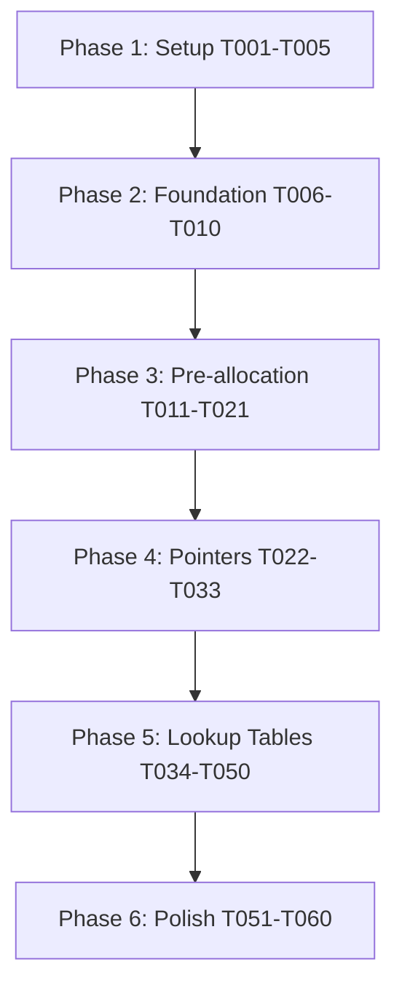

# Tasks: MYSON Parser Performance Optimization to 700+ MB/s

**Input**: Design documents from `/specs/003-performance-1gb/`
**Stretch Goal**: 1 GB/s with future SIMD optimizations (Phase 4, not in current scope)
**Prerequisites**: plan.md, spec.md, research.md, data-model.md, contracts/, quickstart.md

**Organization**: Tasks are grouped by optimization phase (each phase = one user story) to enable independent implementation and testing of each performance improvement.

## Constitution Alignment

- ✅ **JSON superset fidelity**: Performance optimizations are internal only - no grammar changes
- ✅ **Deterministic parser discipline**: Recursive descent structure preserved, pointer arithmetic replaces indexed access
- ✅ **Tests**: All 28 existing tests must pass (100% requirement). No new tests required - performance is validated via benchmarks

## Format: `[ID] [P?] [Story] Description`

- **[P]**: Can run in parallel (different files, no dependencies)
- **[Story]**: Which user story/phase this task belongs to (US1=Phase 1, US2=Phase 2, US3=Phase 3)
- All file paths are absolute from repository root

---

## Phase 1: Setup (Shared Infrastructure)

**Purpose**: Safety infrastructure and baseline measurement before optimization begins

- [X] T001 Add `end_ptr` field to Parser class in src/myson_core.pyx (const unsigned char* pointing to buf + length)
- [X] T002 [P] Implement `check_bounds(p, end)` inline function in src/myson_core.pyx (raises ValueError if p >= end)
- [X] T003 [P] Implement `safe_increment(p, end)` inline function in src/myson_core.pyx (returns p+1 with bounds check)
- [X] T004 Create baseline benchmark script benchmarks/phase0_baseline.py to measure current 136 MB/s performance
- [X] T005 Run all 28 tests and document current pass rate (should be 100%) as baseline in benchmarks/baseline_results.txt

---

## Phase 2: Foundational (Blocking Prerequisites)

**Purpose**: Core safety infrastructure that MUST be complete before ANY optimization work

**⚠️ CRITICAL**: No user story work can begin until this phase is complete

- [X] T006 Initialize Parser.end_ptr in __cinit__ method in src/myson_core.pyx (set to self.buf + self.length)
- [X] T007 Update Parser.__cinit__ to cast buf to const unsigned char* for pointer arithmetic compatibility
- [X] T008 Add module-level constants in src/myson_core.pyx: WHITESPACE_BIT=0x01, DIGIT_BIT=0x02, ALPHA_BIT=0x04, NUMBER_CHAR_BIT=0x08
- [X] T009 Verify compilation succeeds with safety infrastructure (run: python setup.py build_ext --inplace)
- [X] T010 Verify all 28 tests still pass after foundational changes (run: pytest tests/)

**Checkpoint**: Foundation ready - Phase 1 optimization can now begin

---

## Phase 3: User Story 1 - List Pre-allocation Eliminates Append Overhead (Priority: P1) 🎯 MVP

**Goal**: Achieve 2-3x speedup (136 → 300 MB/s) by pre-scanning arrays and using PyList_New + PyList_SET_ITEM

**Independent Test**: Parse benchmarks/super_long.json (294 MB) and measure throughput >= 300 MB/s

### Implementation for User Story 1

- [ ] T011 [P] [US1] Implement `prescan_array_size()` method in src/myson_core.pyx with bounds-checked pointer scanning
- [ ] T012 [P] [US1] Add try...except...finally wrapper to parse_array() in src/myson_core.pyx for memory cleanup on MemoryError
- [ ] T013 [US1] Update parse_array() to call prescan_array_size() before allocation in src/myson_core.pyx
- [ ] T014 [US1] Replace list.append() with PyList_New(size) allocation in parse_array() in src/myson_core.pyx
- [ ] T015 [US1] Replace all array element insertions with PyList_SET_ITEM() in parse_array() in src/myson_core.pyx
- [ ] T016 [US1] Add Py_INCREF calls before PyList_SET_ITEM to maintain correct refcounts in src/myson_core.pyx
- [ ] T017 [US1] Add cleanup code in except block to Py_DECREF partial lists on allocation failure in src/myson_core.pyx
- [ ] T018 [US1] Recompile Cython extension with Phase 1 changes (run: python setup.py build_ext --inplace)
- [ ] T019 [US1] Run all 28 tests to verify 100% pass rate maintained after Phase 1 (run: pytest tests/)
- [ ] T020 [US1] Benchmark Phase 1 performance on super_long.json and verify >= 300 MB/s (create: benchmarks/phase1_preallocation.py)
- [ ] T021 [US1] Document Phase 1 results in benchmarks/phase1_results.txt with throughput and speedup factor

**Checkpoint**: At this point, Phase 1 (pre-allocation) should deliver 2-3x speedup with all tests passing

---

## Phase 4: User Story 2 - Raw Pointer Arithmetic Eliminates Bounds Checks (Priority: P2)

**Goal**: Achieve 1.5-2x additional speedup (300 → 500 MB/s) by converting all buffer access to const unsigned char* pointers

**Independent Test**: Parse super_long.json and measure throughput >= 500 MB/s with pointer arithmetic

### Implementation for User Story 2

- [ ] T022 [P] [US2] Convert skip_whitespace() to use const unsigned char* p with check_bounds() calls in src/myson_core.pyx
- [ ] T023 [P] [US2] Convert parse_value() to use pointer arithmetic with safe_increment() in src/myson_core.pyx
- [ ] T024 [P] [US2] Convert parse_string() to use const unsigned char* with UTF-8 validation in src/myson_core.pyx
- [ ] T025 [P] [US2] Convert parse_number() to use pointer-based scanning in src/myson_core.pyx
- [ ] T025b [P] [US2] Implement zero-copy number parsing using strtod/strtoll directly on buffer in src/myson_core.pyx (FR-010)
- [ ] T026 [US2] Convert parse_object() to use pointer arithmetic for key/value parsing in src/myson_core.pyx
- [ ] T027 [US2] Update all pointer-based functions to synchronize self.pos only for error reporting in src/myson_core.pyx
- [ ] T028 [US2] Add position calculation helper: calc_position(p) = p - self.buf in src/myson_core.pyx
- [ ] T029 [US2] Update all error messages to use calc_position() for line/column reporting in src/myson_core.pyx
- [ ] T030 [US2] Recompile Cython extension with Phase 2 changes (run: python setup.py build_ext --inplace)
- [ ] T031 [US2] Run all 28 tests to verify 100% pass rate maintained after Phase 2 (run: pytest tests/)
- [ ] T032 [US2] Benchmark Phase 2 performance on super_long.json and verify >= 500 MB/s (create: benchmarks/phase2_pointers.py)
- [ ] T033 [US2] Document Phase 2 results in benchmarks/phase2_results.txt with throughput and speedup vs Phase 1

**Checkpoint**: At this point, Phases 1 AND 2 should deliver cumulative 4-5x speedup with all tests passing

---

## Phase 5: User Story 3 - Lookup Tables and Batch Processing Accelerate Character Classification (Priority: P3)

**Goal**: Achieve 1.3-1.5x additional speedup (500 → 700 MB/s) using lookup tables and 8-byte batch whitespace processing

**Independent Test**: Parse super_long.json and measure throughput >= 700 MB/s with lookup tables

### Implementation for User Story 3

- [ ] T034 [P] [US3] Declare module-level CHAR_TABLE[256] static array in src/myson_core.pyx
- [ ] T035 [P] [US3] Implement init_char_table() to initialize bitfield lookups at module load in src/myson_core.pyx
- [ ] T036 [P] [US3] Set WHITESPACE_BIT for space/tab/newline/CR in init_char_table() in src/myson_core.pyx
- [ ] T037 [P] [US3] Set DIGIT_BIT for 0-9 in init_char_table() in src/myson_core.pyx
- [ ] T038 [P] [US3] Set ALPHA_BIT for a-z and A-Z in init_char_table() in src/myson_core.pyx
- [ ] T039 [P] [US3] Set NUMBER_CHAR_BIT for +, -, ., e, E in init_char_table() in src/myson_core.pyx
- [ ] T040 [US3] Call init_char_table() at module initialization in src/myson_core.pyx
- [ ] T041 [US3] Implement skip_whitespace_fast() with 8-byte batch processing in src/myson_core.pyx
- [ ] T042 [US3] Add alignment check: if (p % 8 == 0) use batch processing in skip_whitespace_fast() in src/myson_core.pyx
- [ ] T043 [US3] Implement 8-byte whitespace detection using uint64_t comparison in skip_whitespace_fast() in src/myson_core.pyx
- [ ] T044 [US3] Replace character-by-character whitespace checks with CHAR_TABLE[c] & WHITESPACE_BIT in src/myson_core.pyx
- [ ] T045 [US3] Replace digit checks with CHAR_TABLE[c] & DIGIT_BIT in parse_number() in src/myson_core.pyx
- [ ] T046 [US3] Replace alpha checks with CHAR_TABLE[c] & ALPHA_BIT where applicable in src/myson_core.pyx
- [ ] T047 [US3] Recompile Cython extension with Phase 3 changes (run: python setup.py build_ext --inplace)
- [ ] T048 [US3] Run all 28 tests to verify 100% pass rate maintained after Phase 3 (run: pytest tests/)
- [ ] T049 [US3] Benchmark Phase 3 performance on super_long.json and verify >= 700 MB/s (create: benchmarks/phase3_lookuptables.py)
- [ ] T050 [US3] Document Phase 3 results in benchmarks/phase3_results.txt with throughput and speedup vs Phase 2

**Checkpoint**: At this point, all three phases should deliver cumulative 5-7x speedup (136 → 700+ MB/s)

---

## Phase 6: Polish & Cross-Cutting Concerns

**Purpose**: Final optimizations, compiler flags, and validation

- [ ] T051 [P] Update setup.py to include compiler flags: -O3 -march=native -ffast-math
- [ ] T052 [P] Add nogil blocks to skip_whitespace_fast() where no Python objects accessed in src/myson_core.pyx
- [ ] T053 [P] Add nogil blocks to prescan_array_size() for pure pointer arithmetic in src/myson_core.pyx
- [ ] T054 Recompile with full optimizations (run: python setup.py build_ext --inplace)
- [ ] T055 Run final full test suite to verify 100% pass rate (run: pytest tests/ -v)
- [ ] T056 Run final benchmark on super_long.json to measure ultimate throughput (run: python benchmarks/phase3_lookuptables.py)
- [ ] T057 Create comparison report showing 136 MB/s → final MB/s in benchmarks/final_report.md
- [ ] T058 Verify memory overhead <= 10% by profiling with memory_profiler
- [ ] T059 Document edge case handling: empty arrays, deeply nested, unaligned data, UTF-8 strings in docs/
- [ ] T059b [P] Validate empty array/object handling doesn't trigger pre-scan or allocation (run: pytest tests/ -k empty)
- [ ] T060 Update README.md with new performance numbers and benchmarking instructions

---

## Task Summary

**Total Tasks**: 62 (added T025b for zero-copy numbers, T059b for empty structure validation)  
**Parallelizable Tasks**: 25 (marked with [P])  
**Organization**: 
- Setup: 5 tasks
- Foundational: 5 tasks (blocking)
- Phase 1 (US1): 11 tasks → 300 MB/s target
- Phase 2 (US2): 12 tasks → 500 MB/s target  
- Phase 3 (US3): 17 tasks → 700 MB/s target
- Polish: 10 tasks → final optimizations

**Key Milestones**:
1. After T010: Safety infrastructure complete
2. After T021: Phase 1 delivering 2-3x speedup
3. After T033: Phase 2 delivering 4-5x cumulative speedup
4. After T050: Phase 3 delivering 5-7x cumulative speedup
5. After T060: Production-ready with full documentation

**MVP Scope**: Phase 1 (Tasks T001-T021) delivers immediate 2-3x performance improvement

---

## Dependencies

**User Story Completion Order**: Must complete phases sequentially (1 → 2 → 3) as each builds on previous

**Within Each Phase**: Tasks marked [P] can execute in parallel

### Phase 1 (Pre-allocation) Parallel Opportunities:
- T011 (prescan_array_size) ∥ T012 (try...finally wrapper)

### Phase 2 (Pointers) Parallel Opportunities:
- T022 (skip_whitespace) ∥ T023 (parse_value) ∥ T024 (parse_string) ∥ T025 (parse_number)

### Phase 3 (Lookup Tables) Parallel Opportunities:
- T034-T039 (all CHAR_TABLE initialization tasks can run in parallel)

---

## Implementation Strategy

**Approach**: Phased optimization with mandatory validation gates

### Phase Execution Pattern:
1. Implement phase tasks (T0XX)
2. Recompile extension
3. Run all 28 tests → MUST achieve 100% pass rate
4. Benchmark performance → MUST meet phase target
5. Document results
6. Only proceed to next phase if gates pass

### Performance Gates:
- **Phase 1 Gate**: >= 300 MB/s (2-3x from 136 MB/s baseline)
- **Phase 2 Gate**: >= 500 MB/s (1.5-2x additional from Phase 1)
- **Phase 3 Gate**: >= 700 MB/s (1.3-1.5x additional from Phase 2)

### Safety Requirements:
- Every pointer dereference MUST use check_bounds()
- Every pointer increment MUST use safe_increment()
- Every allocation MUST have try...finally cleanup
- All tests MUST maintain 100% pass rate

**Rollback Strategy**: If any phase fails gates, revert that phase and analyze before retrying
